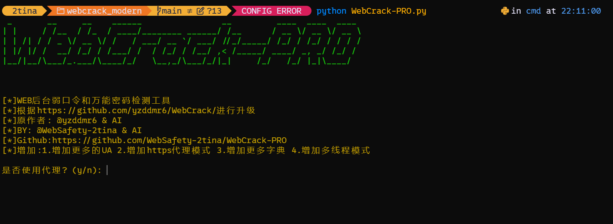

# WebCrack Pro Version

WebCrack Pro 是一款先进的Web应用程序登录接口弱密码和通用密码检测工具。这是基于 [yzddmr6/WebCrack](https://github.com/yzddmr6/WebCrack) 进行二次创作的现代化版本，具有改进的代码结构、增强的验证码识别功能和更好的可维护性。



## 目录
- [项目起源](#项目起源)
- [功能特性](#功能特性)
- [技术架构](#技术架构)
- [安装指南](#安装指南)
- [使用教程](#使用教程)
- [操作模式](#操作模式)
- [配置说明](#配置说明)
- [验证码处理](#验证码处理)
- [日志系统](#日志系统)
- [常见问题](#常见问题)
- [漏洞修复和改进](#漏洞修复和改进)
- [法律声明](#法律声明)

## 项目起源

本项目基于 [yzddmr6/WebCrack](https://github.com/yzddmr6/WebCrack) 进行二次创作开发，旨在：

1. **现代化代码结构**：重构原有代码，采用模块化设计和面向对象编程
2. **增强功能**：添加多线程支持、彩色输出、详细日志等新功能
3. **改进用户体验**：提供简单/复杂模式选择，优化交互流程
4. **提高可维护性**：清晰的代码结构和详细的文档

原始项目地址：[https://github.com/yzddmr6/WebCrack](https://github.com/yzddmr6/WebCrack)

## 功能特性

- 🔐 弱密码检测
- 🔑 通用密码检测
- 🖼️❌ 验证码识别（使用 ddddocr 进行 OCR）❌
- 📋 多 URL 批量处理
- ⚙️ 可自定义的暴力破解规则
- 📝 自动日志生成
- 🎯 两种操作模式（简单/复杂）
- 🧵 多线程支持
- ⏱️ 任务超时机制（3分钟超时自动跳过）

## 技术架构

### 核心组件

```
webcrack pro/
├── WebCrack-PRO.py         # 主程序入口
├── src/
│   ├── core/
│   │   ├── brute_force.py      # 暴力破解核心实现
│   │   └── page_parser.py      # 页面解析和验证码处理
│   ├── utils/
│   │   ├── config.py           # 配置管理
│   │   ├── dict_generator.py   # 字典生成
│   │   ├── header_generator.py # HTTP 头生成
│   │   └── logger.py           # 日志功能
│   └── modules/
│       └── 1.png               # 程序界面截图
├── conf/                       # 配置文件和字典
│   ├── username.txt            # 用户名字典
│   ├── password.txt            # 密码字典
│   └── password_list.txt       # 简单模式密码字典
├── logs/                       # 日志文件
├── requirements.txt            # Python 依赖
└── README.md                   # 本文档
```

### 技术栈

- **语言**: Python 3.x
- **网络请求**: requests
- **HTML 解析**: beautifulsoup4, lxml
- **验证码识别**: ddddocr
- **终端美化**: pyfiglet
- **并发处理**: concurrent.futures

## 安装指南

### 环境要求

- Python 3.6+ (推荐使用 Python 3.8+ 以获得更好的兼容性)
- pip 包管理器
- Git (用于克隆项目)

### 安装步骤

#### 1. 克隆项目
```bash
git clone <repository-url>
cd WebCrack Pro
```

#### 2. (推荐) 创建虚拟环境
```bash
# 创建虚拟环境
python -m venv venv

# 激活虚拟环境
# Windows:
venv\Scripts\activate
# macOS/Linux:
source venv/bin/activate
```

#### 3. 安装依赖
```bash
# 安装主依赖
pip install -r requirements.txt

# (可选) 安装验证码识别支持
pip install ddddocr
```

> 💡 **提示**: 如果遇到权限问题，可以在命令后添加 `--user` 参数或使用管理员/root权限执行命令。
> 
> 💡 **提示**: 建议使用国内镜像加速安装，例如：`pip install -r requirements.txt -i https://pypi.tuna.tsinghua.edu.cn/simple`

## 使用教程

### 基本使用流程

1. **运行程序**：
   ```bash
   python WebCrack-PRO.py
   ```

2. **选择操作模式**：
   - 简单模式：快速扫描，使用较小字典
   - 复杂模式：全面扫描，使用完整字典

3. **配置代理**（可选）：
   - 可以为所有请求设置 HTTP/HTTPS 代理

4. **提供目标 URL**：
   - 输入单个 URL 或包含多个 URL 的文件路径

5. **等待结果**：
   - 程序将自动执行暴力破解并显示结果

### 操作示例

```bash
# 运行程序
$ python WebCrack-PRO.py

[WebCrack Pro]
请选择模式 (1: 简单模式 2: 复杂模式): 2
是否使用代理? (y/n): n
请输入URL文件名或单个URL:
http://example.com/login

[*] 开始扫描 http://example.com/login
[*] 使用字典: 用户名 10 个, 密码 100 个
[*] 正在测试 admin:123456... 成功!
[+] 找到有效凭证: admin / s3cr3t
```

### 程序界面


*图1: WebCrack Pro 主界面*

- **顶部**: ASCII艺术标题，显示工具名称
- **中间**: 功能特性列表，黄色高亮显示
- **底部**: 用户交互提示，询问是否使用代理

## 操作模式

### 简单模式

- 仅使用基础用户名（如 'admin'）和 [password_list.txt](file:///c%3A/Users/2tina/Desktop/WebCrack-master/WebCrack Pro/conf/password_list.txt) 中的密码
- 适用于快速安全检查
- 测试组合较少，执行速度快

### 复杂模式

- 使用 [username.txt](file:///c%3A/Users/2tina/Desktop/WebCrack-master/WebCrack Pro/conf/username.txt) 和 [password.txt](file:///c%3A/Users/2tina/Desktop/WebCrack-master/WebCrack Pro/conf/password.txt) 中的完整字典
- 适用于全面安全评估
- 测试组合较多，执行时间较长

## 配置说明

配置文件位于 `src/utils/config.py`，主要配置项包括：

### 暴力破解设置
```python
"brute_force": {
    "timeout": 10,           # 请求超时时间
    "delay": 0.03,           # 请求间隔延迟
    "test_username": "admin", # 测试用户名
    "test_password": "length_test", # 测试密码
    "requests_proxies": {},  # 代理设置
    "max_workers": 1,        # 多线程工作数
    "fail_words": [...]      # 失败关键词列表
}
```

### 字典设置
```python
"dictionary": {
    "base": {                # 基础字典
        "username_list": ['admin'],
        "password_list": txt2list("password_list.txt")
    },
    "file": {                # 文件字典
        "enabled": True,
        "username_file": "username.txt",
        "password_file": "password.txt"
    },
    "domain": {              # 域名字典
        "enabled": True,
        "suffix_list": ["", "123", "666", "888", "123456"]
    },
    "sql_injection": {       # SQL注入字典
        "enabled": True,
        "payload_list": [
            "admin' or 'a'='a",
            "'or'='or'",
            "admin' or '1'='1' or 1=1",
            "')or('a'='a",
            "'or 1=1 -- -"
        ]
    }
}
```

## ❌验证码处理❌

### 自动识别

当安装了 ddddocr 库时，程序会自动识别验证码：
1. 检测登录页面中的验证码元素
2. 下载验证码图片
3. 使用 OCR 技术识别验证码内容
4. 在暴力破解过程中自动填写验证码

### 降级处理

如果未安装 ddddocr，程序会：
1. 检测验证码关键字
2. 遇到验证码时停止处理当前站点
3. 记录相关信息并继续处理其他站点

## 日志系统

### 日志类型

- **通用日志**: `logs/logs.txt` - 记录所有活动和错误
- **成功日志**: `logs/success.txt` - 记录成功的暴力破解结果

### 日志格式

```
[时间戳]  任务ID: [消息内容]
```

### 颜色标识

- **绿色**: 成功消息
- **紫色**: 错误消息
- **默认色**: 信息消息

## 常见问题

### 1. 程序运行缓慢

**可能原因**：
- 目标网站响应慢
- 网络连接问题
- 未启用多线程

**解决方案**：
- 检查网络连接
- 在配置中增加 `max_workers` 值
- 使用代理改善网络状况

### 2. 无法找到表单元素

**可能原因**：
- 页面不是标准登录页面
- 页面使用 JavaScript 动态加载
- 网站返回错误页面

**解决方案**：
- 检查 URL 是否正确
- 手动验证页面结构
- 查看详细错误信息

### 3. 验证码识别失败

**可能原因**：
- 未安装 ddddocr 库
- 验证码过于复杂
- 网站使用高级验证码

**解决方案**：
- 安装 ddddocr: `pip install ddddocr`
- 跳过包含验证码的站点
- 使用其他测试方法

### 4. 多线程模式下输出混乱

**说明**：
这是正常现象，因为多个线程同时输出信息。

**解决方案**：
- 查看日志文件获取结构化信息
- 使用单线程模式获得清晰输出

### 5. 字典文件路径问题

**说明**：
程序会自动在 `conf/` 目录下查找字典文件。

**解决方案**：
- 确保字典文件位于正确位置
- 检查文件名是否匹配配置

### 性能改进

1. **内存使用优化**：
   - 优化了字典生成和处理过程
   - 减少了不必要的内存占用

2. **响应处理优化**：
   - 改进了响应长度计算方法
   - 增强了对不同响应类型的处理能力

3. **错误处理增强**：
   - 添加了更详细的错误信息
   - 增强了异常处理的健壮性

## 法律声明

⚠️ **重要提醒**：

本工具仅供以下目的使用：
- 教育学习
- 安全研究
- 授权测试

**严禁**用于以下行为：
- 未经授权的系统访问
- 非法入侵活动
- 损害他人系统安全

使用本工具前请确保：
1. 获得目标系统的明确授权
2. 遵守相关法律法规
3. 仅在测试环境中使用

开发者不对任何非法使用本工具的行为负责。

本项目基于 [yzddmr6/WebCrack](https://github.com/yzddmr6/WebCrack) 进行二次创作，原始项目版权归原作者所有。